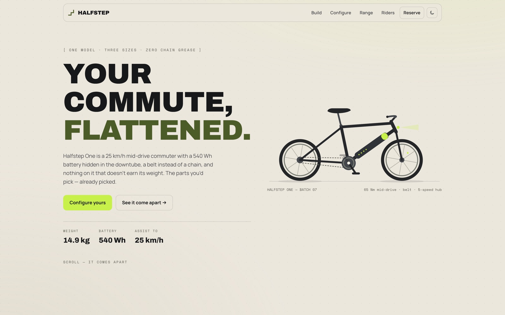

<!-- parable:beautified -->
<div align="center">

<h1>Halfstep</h1>

<p><strong>Urban e-bike brand — the bike flies apart into a labelled exploded diagram on scroll, with a spec configurator.</strong></p>

<p>
  <a href="https://bswxyz.github.io/halfstep/"></a>
  
  
  <a href="LICENSE"></a>
</p>

<p>
  <a href="https://bswxyz.github.io/halfstep/"><b>Live demo</b></a>
  &nbsp;·&nbsp;
  <a href="https://bswxyz.github.io/halfstep/guide/">Build notes</a>
  &nbsp;·&nbsp;
  <a href="https://parable-three.vercel.app/templates">More templates</a>
</p>

<a href="https://bswxyz.github.io/halfstep/">
  
</a>

</div>

**Use this template** — copy the source into a new project:

```bash
npx degit bswxyz/halfstep my-app
```


One urban e-bike, stated plainly — with an exploded-assembly scroll as the centrepiece. Part of
the [Parable design showcase](https://parable-three.vercel.app).

---

## The concept

Halfstep sells exactly one bike: the Halfstep One, a 25 km/h mid-drive commuter with a 540 Wh
battery in the downtube, a carbon belt instead of a chain, and a 5-speed internal hub. The brand
voice is clean, engineered and city-confident — specs are stated where you can check them, range
is a calculator instead of a claim, and the hero promise is simply "Your commute, flattened."
The signature moment: scrolling through the build section takes the bike apart into six labelled
assemblies and bolts it back together.

## Design system

- **Palette:** light (default) is bone `#ece7dd` with graphite `#17181a` ink; dark flips them.
  Accent is hi-viz lime `#c7f04a` — used only as fills, chips and marks, because it can't pass
  text contrast on bone. Text accents use `--acc-text`: moss-dark `#4c5c28` in light mode, full
  lime in dark. Secondary moss `#5a6b3a` anchors the range bar and one paint option.
- **Type:** `Archivo` 800/900 (display, uppercase, tight), `Manrope` 400–700 (body/UI),
  `Space Mono` (specs, eyebrows, callout labels — everything a torque wrench would say).
- **Signature ease:** `--ease-cadence: cubic-bezier(.21,.86,.26,.99)` — a pedal stroke's
  follow-through — plus `--ease-pop` with slight overshoot for chips and buttons.
- **Motion:** clipped-line hero rise, IntersectionObserver reveals, the exploded-assembly scroll,
  and a live-repainting bike (paint is one CSS variable). Full `prefers-reduced-motion` support.

## Stack

- **Vite + vanilla TypeScript.** No framework, no runtime dependencies. The flourish is ~120
  lines: scroll progress → three phases (fly out / hold / fly home) → staggered per-part
  transforms on SVG groups, with callout leader lines chasing their parts.
- The bike is hand-plotted inline SVG (stroke tubes, circle wheels) — no image files anywhere.
- Configurator and range calculator share one battery value through a ten-line pub-sub
  (`src/state.ts`), so picking a pack updates the estimate and says so.
- Google Fonts (Archivo / Manrope / Space Mono) is the only external resource.

## Running it locally

```bash
git clone https://github.com/bswxyz/halfstep
cd halfstep
npm install
npm run dev        # Vite dev server → http://localhost:5173/halfstep/
npm run build      # typecheck + build → docs/
npm run preview    # serve the built docs/ locally
```

## Structure

```
index.html            the page — semantic sections, .js gate, both bike SVGs inline
styles.css            all styling — light + dark tokens in :root at the top
src/main.ts           wiring: theme, reveals, flourish, configurator, calculator, form
src/explode.ts        the exploded-assembly scroll (the signature)
src/configurator.ts   size / battery / paint → price, weight, range, live repaint
src/rangecalc.ts      assist × weight × terrain → honest kilometres
src/state.ts          one shared value: the chosen battery pack
src/theme.ts          light/dark toggle, localStorage "halfstep-theme"
src/reveal.ts         IntersectionObserver reveals + counters
src/form.ts           demo reserve form (validates, confirms, sends nothing)
public/guide/         "How Halfstep was built" — self-contained, copied into docs/
public/.nojekyll      keeps GitHub Pages from post-processing docs/
vite.config.ts        base '/halfstep/', outDir 'docs'
```

## Demo vs. real — what a production version would need

Intentionally scoped as a design showcase. What's **fiction/simulated** today:

- **Halfstep is not a real company.** The bike, specs, prices, batch numbers, cities and riders
  are invented (plausible, but invented).
- **The reserve form sends nothing.** It validates and confirms in place. A real one needs a
  backend, a payment provider for the deposit, and an actual refund policy.
- **The range calculator is a first-order model.** Real range estimation would want motor
  efficiency curves, temperature, wind, tyre pressure and recorded ride data.
- **The configurator doesn't persist or price-check.** Production would need inventory, a cart,
  and legal smallprint per market.

What's **real** and reusable as-is: the exploded-assembly scroll technique, the CSS-variable
paint system, the battery pub-sub wiring, the theme toggle, and the reduced-motion/no-JS
progressive enhancement pattern.

## License

[MIT](LICENSE). Design & build by **Parable**. No photographic or generated
image assets — the bike is drawn entirely with code.
